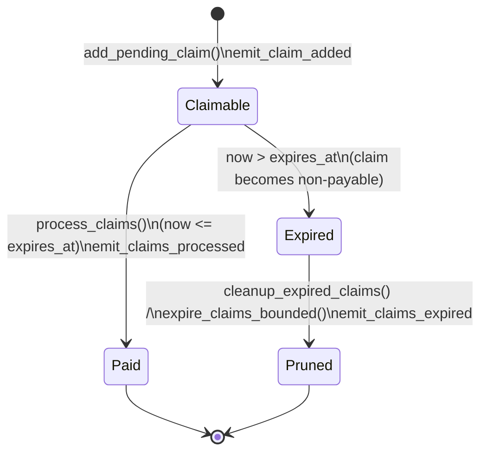

# Claims Lifecycle Reference (`credence_bond`)

A contributor / integrator reference for the pull-payment claims subsystem in
[`contracts/credence_bond/src/claims.rs`](../src/claims.rs). Events are defined in
[`contracts/credence_bond/src/events.rs`](../src/events.rs).

The claims module implements a **pull-payment** pattern: rewards are recorded as
*pending claims* against a user's address, and the user (or a keeper, for pruning)
later pulls them. This shifts the gas cost of payout onto the claimant and avoids
failed-transfer griefing during the reward-granting transaction.

> Soroban SDK 22. This document describes **current behavior**. Where the code does
> not yet implement an intended behavior, it is flagged with **GAP**.

---

## 1. Claim types — [`ClaimType`](../src/claims.rs)

`ClaimType` is a `#[contracttype]` enum with explicit discriminants (wire-stable):

| Variant | Discriminant | Meaning |
| --- | --- | --- |
| `VerifierReward`  | 0 | Verifier rewards from successful attestations |
| `SlashingReward`  | 1 | Rewards for a successful slashing challenge |
| `PenaltyRefund`   | 2 | Partial refund of an early-exit penalty |
| `FeeRebate`       | 3 | Protocol fee rebates |
| `DisputeReward`   | 4 | Dispute-resolution rewards |

The type is informational for accounting; the lifecycle is identical across all
types.

## 2. Claim record — [`PendingClaim`](../src/claims.rs)

| Field | Type | Notes |
| --- | --- | --- |
| `claim_id`   | `u64`       | Unique, monotonically increasing (see `ClaimCounter`). |
| `claim_type` | `ClaimType` | One of the types above. |
| `amount`     | `i128`      | Strictly positive; `add_pending_claim` panics on `amount <= 0`. |
| `created_at` | `u64`       | Ledger timestamp at creation. |
| `expires_at` | `u64`       | `created_at + DEFAULT_CLAIM_EXPIRY`. `0` means *no expiry*. |
| `source_id`  | `u64`       | The source transaction/event that generated the claim. |
| `metadata`   | `Symbol`    | Optional caller-supplied tag (empty `Symbol` if `None`). |
| `processed`  | `bool`      | Always stored as `false`. **GAP — see §6.** |

## 3. Constants

| Constant | Value | Purpose |
| --- | --- | --- |
| `MAX_BATCH_CLAIMS`    | `50`               | Hard cap on claims handled per `process_claims` / `expire_claims_bounded` call. Bounds CPU/read budget. |
| `DEFAULT_CLAIM_EXPIRY`| `30 * 24 * 60 * 60` (30 days, seconds) | Window added to `created_at` to derive `expires_at`. |
| `LEDGER_BUMP_BUFFER`  | `17_280` (~1 day)  | Safety buffer added to a claim's persistent TTL. |
| `SECONDS_PER_LEDGER`  | `5`                | Conversion factor used by `ttl_for_claim`. |

## 4. State lifecycle



Plain-text view of the same transitions:

```
created ── add_pending_claim ──▶ CLAIMABLE
CLAIMABLE ── process_claims (now <= expires_at) ──▶ PAID (removed from storage)
CLAIMABLE ── clock passes expires_at ──▶ EXPIRED (still stored, not payable)
EXPIRED   ── cleanup_expired_claims / expire_claims_bounded ──▶ PRUNED (removed)
```

### Transition details

- **created → CLAIMABLE** — `add_pending_claim` assigns the next `claim_id`, sets
  `expires_at = now + DEFAULT_CLAIM_EXPIRY`, appends to the user's
  `PendingClaims(user)` vector, stores a by-id copy under `ClaimById(claim_id)`,
  and increments the running `ClaimableAmount(user)` total.
- **CLAIMABLE → PAID** — `process_claims` (requires the user's `require_auth`)
  filters by the optional `claim_types` set, skips expired claims, processes up to
  `min(max_claims, MAX_BATCH_CLAIMS)` claims, transfers the summed `amount` from
  the contract to the user via the configured `BondToken`, and **removes** the
  processed claims from storage (rather than flagging them — see §6).
- **CLAIMABLE → EXPIRED** — purely time-based. Once `now > expires_at` the claim
  is skipped by `process_claims` and is no longer payable, but it stays in storage
  until pruned.
- **EXPIRED → PRUNED** — either `cleanup_expired_claims` (unbounded scan) or
  `expire_claims_bounded` (bounded to `MAX_BATCH_CLAIMS`, exposed as the
  `expire_claims` contract entrypoint). Both are **permissionless** ("pay to
  prune"): anyone can call them and pay the gas, decrementing
  `ClaimableAmount(user)` by the expired total. Claims with `expires_at == 0` are
  never pruned.

## 5. Events table

All claim events are defined in [`events.rs`](../src/events.rs). Topic 0 is the
event `Symbol`; topic 1 is the user `Address`.

| Transition | Function | Event symbol | Emitter | Data payload |
| --- | --- | --- | --- | --- |
| created → CLAIMABLE | `add_pending_claim`     | `claim_added`      | `emit_claim_added`      | `(claim_type, amount, source_id)` |
| CLAIMABLE → PAID    | `process_claims`        | `claims_processed` | `emit_claims_processed` | `(processed_count, total_amount, claim_types)` |
| EXPIRED → PRUNED    | `cleanup_expired_claims` / `expire_claims_bounded` | `claims_expired` | `emit_claims_expired` | `(expired_count, expired_amount)` |

There is **no event** for the CLAIMABLE → EXPIRED transition: expiry is implicit
(clock-driven) and only becomes observable when the claim is pruned.

## 6. Known gaps (accurate to current code)

- **`processed` is never set to `true`.** `add_pending_claim` always writes
  `processed: false`, and `process_claims` *removes* paid claims from the user's
  vector instead of flipping the flag. The field therefore cannot be used to
  distinguish paid from unpaid claims; "paid" is represented by *absence* from
  storage. `expire_claims_bounded` defensively preserves any claim where
  `processed == true`, but in practice no claim ever reaches that state.
- **No partial-payment marker.** A claim is either fully present (claimable) or
  removed (paid/pruned); there is no concept of a partially paid claim.

## 7. Backend integration — reconstructing claimable balance from events

An indexer can reconstruct a user's claimable balance **without reading contract
storage** by folding the event stream per user address:

1. On `claim_added(user)` → record `{claim_id?, claim_type, amount, source_id}`
   and add `amount` to the user's running claimable balance. (`claim_id` is not in
   the event payload; if you need it, correlate by `source_id` + ordering, or read
   `ClaimById` once. This is a deliberate trade-off documented here.)
2. On `claims_processed(user)` → subtract `total_amount` from the running balance
   and mark `processed_count` claims of the listed `claim_types` as paid (FIFO by
   `claim_id`, matching on-chain ordering).
3. On `claims_expired(user)` → subtract `expired_amount` from the running balance
   and mark `expired_count` claims as pruned.

The invariant `running_balance == ClaimableAmount(user)` should hold after every
event is applied in stream order. Because `process_claims` and the prune paths can
each touch at most `MAX_BATCH_CLAIMS` claims per call, large claim sets emit
multiple `claims_processed` / `claims_expired` events; the indexer must apply them
in ledger order and must not reorder them against `claim_added`.

### Keeper jobs

- A **prune keeper** should call `expire_claims(user, 50)` (or
  `cleanup_expired_claims`) for users with stale claims to reclaim storage and keep
  `ClaimableAmount` accurate. It is permissionless and pays its own gas.
- A **payout watcher** only needs the three events above; it never needs to call
  any mutating entrypoint.
