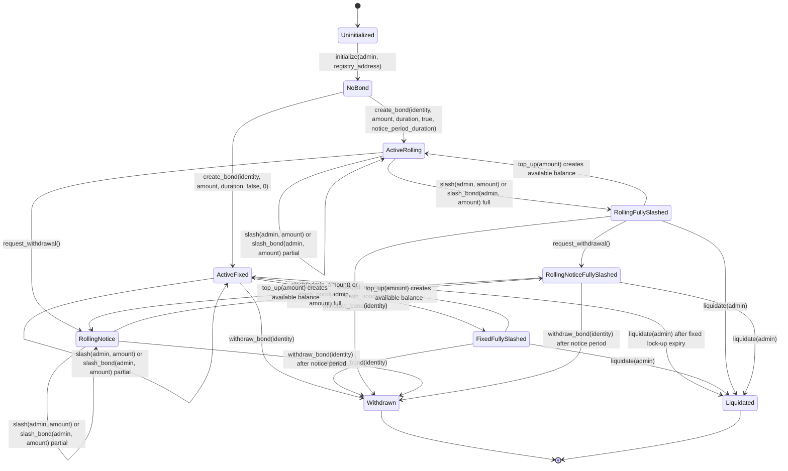

# Credence Bond State Transitions

Audience: contributors changing `contracts/credence_bond`.

This document records the intended lifecycle for the single `IdentityBond` stored
under `DataKey::Bond`. Use it when reviewing changes to lifecycle entrypoints so
that code, tests, and support guidance stay aligned.

## State Fields

The lifecycle is derived from these stored fields:

| Field | Meaning |
| --- | --- |
| `active` | `true` while the bond can still be slashed, topped up, renewed, or withdrawn. |
| `is_rolling` | `true` for rolling bonds that renew at period boundaries until notice is requested. |
| `withdrawal_requested_at` | `0` until a rolling bond owner calls `request_withdrawal`; then it stores the notice start timestamp. |
| `bonded_amount` | Total collateral recorded for the bond. |
| `slashed_amount` | Cumulative slashed collateral. A bond is fully slashed when `slashed_amount >= bonded_amount`. |

## Mermaid Diagram



## Entrypoint Notes

`initialize(admin, registry_address)` sets the admin and optionally invokes the
registry, but it does not create a bond. The lifecycle remains `NoBond` until
`create_bond` stores `IdentityBond`.

`create_bond(identity, amount, duration, is_rolling, notice_period_duration)` is
the creation entrypoint. A concrete fixed-duration call from tests looks like:

```rust
client.create_bond(&identity, &1000_i128, &86_400_u64, &false, &0_u64);
```

A rolling bond uses the same entrypoint with `is_rolling = true` and a non-zero
notice period:

```rust
client.create_bond(&identity, &1000_i128, &86_400_u64, &true, &3_600_u64);
```

`top_up(amount)`, `extend_duration(additional_duration)`, `withdraw(amount)`,
and `withdraw_early(amount)` mutate amount or duration while leaving `active`
unchanged. `withdraw` is for post-lock-up withdrawals; `withdraw_early` applies
the configured early-exit penalty before the lock-up ends.

`request_withdrawal()` is rolling-only. It moves a rolling bond into notice by
setting `withdrawal_requested_at` to the current ledger timestamp. After
`notice_period_duration` elapses, `withdraw_bond(identity)` can close the
position and set `active = false`.

`renew_if_rolling()` only advances `bond_start` for active rolling bonds whose
period ended and whose `withdrawal_requested_at` is still `0`. It is a no-op for
fixed bonds and for rolling bonds already in notice.

`slash(admin, amount)` and `slash_bond(admin, slash_amount)` increase
`slashed_amount`. A partial slash keeps the bond active; a full slash makes the
bond eligible for `liquidate(admin)`.

`liquidate(admin)` closes an active bond by setting `active = false` and storing
`DataKey::Liquidated(identity) = true`. It is valid only when the bond is fully
slashed or when a fixed-duration bond has expired without renewal.

`withdraw_bond(identity)` closes the bond by setting `active = false` and
returning the unslashed amount. For rolling bonds, notice must have been
requested and elapsed.

## Review Checklist

- New lifecycle entrypoints must appear in the Mermaid diagram.
- New terminal states must define how indexers distinguish them from existing
  inactive states.
- State changes must continue to call `invariants::assert_self_consistent(&e)`.
- Entrypoints must preserve `#![no_std]` discipline and use `soroban_sdk`
  primitives.
