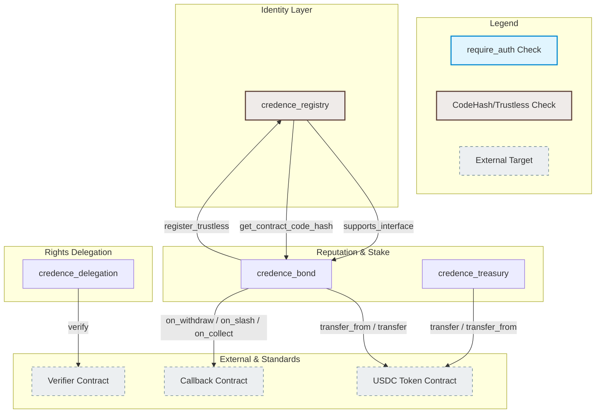
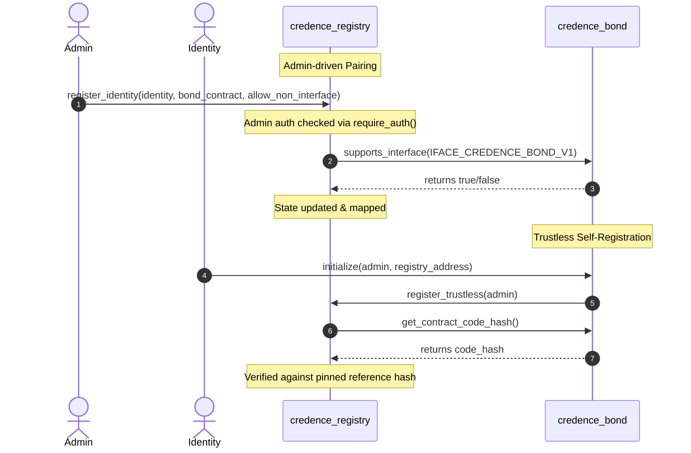
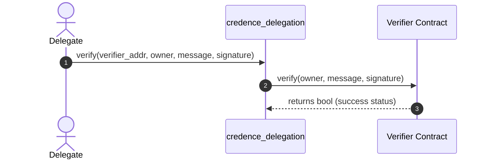
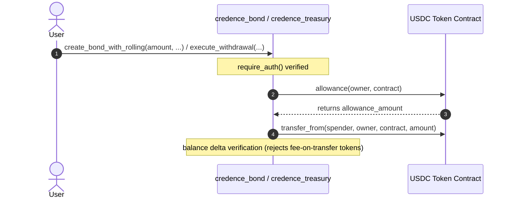
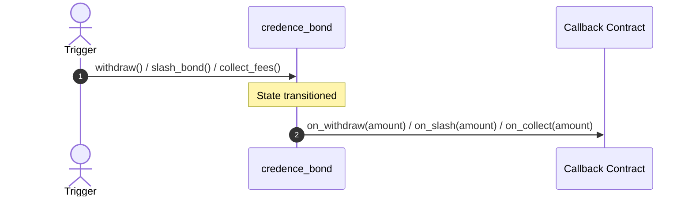

# Cross-Contract Call Graph & Authorization Flow

This document details the cross-contract call pathways, interface checks, callback architectures, and authorization checkpoints for the Credence protocol contracts.

---

## High-Level Call Graph

The following diagram illustrates how the core contracts (`credence_bond`, `credence_registry`, `credence_delegation`, and `credence_treasury`) interact with each other and with external dependencies (the USDC Token contract, custom Verifier contracts, and custom Callback contracts).



---

## Detailed Call Edge Specifications

### 1. `credence_registry` $\leftrightarrow$ `credence_bond`



- **`supports_interface` Check:** `register_identity` performs an ERC165-equivalent interface verification on the target `bond_contract` using the identifier `IFACE_CREDENCE_BOND_V1`.
- **`register_trustless` Hash Introspection:** To bypass the admin trust assumption, a bond contract can register itself with the registry. The registry calls `get_contract_code_hash` back on the caller and performs a constant-time memory comparison (`constant_time_eq`) against the admin-pinned reference WASM hash to ensure authenticity.

### 2. `credence_delegation` $\rightarrow$ `Verifier Contract`



- **Dynamic Signature Dispatch:** The delegation contract dynamically forwards verification requests to specialized signature schemes. The target contract must implement:
  ```rust
  pub fn verify(e: Env, owner: Address, message: Bytes, signature: Bytes) -> bool
  ```
- **Rejection Propagation:** Any verification failure or panic in the external verifier rolls back the delegation contract call.

### 3. Core Contracts $\rightarrow$ `USDC Token` (Token Contract)



- **Front-Running & Allowance Guards:** Both the bond and treasury contracts invoke standard token methods (`transfer`, `transfer_from`, `allowance`, `approve`).
- **Balance-Delta Verification:** In custody actions, contracts query the token balance before and after execution to enforce that the exact expected amount is transferred, mitigating risks of fee-on-transfer tokens.

### 4. `credence_bond` $\rightarrow$ `Callback Contract`



- **Callback Hook Safety:** If a `callback` contract address is configured in the bond instance, it will be invoked on key lifecycle transitions:
  - `on_withdraw(withdraw_amount)`
  - `on_slash(slash_amount)`
  - `on_collect(fee_amount)`
- **Atomic Rollback Hook:** Since the call is inline and synchronous, any callback failures or panics roll back the entire transaction.

---

## Authorization Matrix

| Contract | Function | Caller / Auth | Nonce / Replay Check |
|---|---|---|---|
| `credence_bond` | `create_bond_with_rolling` | `identity.require_auth()` | No (one-off creation) |
| `credence_bond` | `add_attestation` | `attester.require_auth()` | Yes (`nonce::consume_nonce`) |
| `credence_bond` | `add_attestation_batch` | Each `item.attester.require_auth()` | Yes (Per-item `nonce`) |
| `credence_bond` | `slash_bond` | `admin.require_auth()` | No (Admin/governance trigger) |
| `credence_bond` | `collect_fees` | `admin.require_auth()` | No |
| `credence_registry` | `register_identity` | `admin.require_auth()` | No |
| `credence_delegation` | `create_delegation` | `owner.require_auth()` | Yes (`nonce`) |
| `credence_treasury` | `propose_withdrawal` | `signer.require_auth()` | Yes (`nonce`) |
