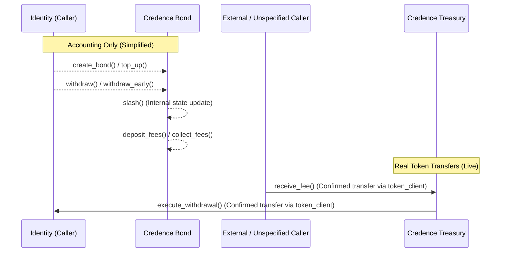

# Token Custody and Fund Flow

This document provides a consolidated token-custody trace across the `credence_bond` and `credence_treasury` contracts. It is intended for auditors and integrators to clearly differentiate between pure accounting state updates and live token transfers.

## Flow Trace

The table below outlines the core fund flow lifecycle, from bond creation to treasury withdrawal. It explicitly marks which steps perform real token transfers (`Live`) versus pure accounting updates (`Simplified`).

| Step                           | Contract            | File                                          | Function             | Line | Status         | Justification                                                                                                             |
| ------------------------------ | ------------------- | --------------------------------------------- | -------------------- | ---- | -------------- | ------------------------------------------------------------------------------------------------------------------------- |
| 1. Bond Creation               | `credence_bond`     | `contracts/credence_bond/src/lib.rs`          | `create_bond`        | 405  | **Simplified** | Token transfer is stubbed; only internal state is updated.                                                                |
| 2. Bond Top Up                 | `credence_bond`     | `contracts/credence_bond/src/lib.rs`          | `top_up`             | 993  | **Simplified** | Bond amount is incremented without a real token transfer.                                                                 |
| 3. Deposit Fees                | `credence_bond`     | `contracts/credence_bond/src/lib.rs`          | `deposit_fees`       | 1087 | **Simplified** | Accrues fee balance in state without custody changes.                                                                     |
| 4. Collect Fees                | `credence_bond`     | `contracts/credence_bond/src/lib.rs`          | `collect_fees`       | 1279 | **Simplified** | Invokes callback and zeroes balance but moves no tokens.                                                                  |
| 5. Slash Bond                  | `credence_bond`     | `contracts/credence_bond/src/lib.rs`          | `slash`              | 962  | **Simplified** | Reduces withdrawable amount in state; no tokens are sent to the treasury.                                                 |
| 6. Withdraw                    | `credence_bond`     | `contracts/credence_bond/src/lib.rs`          | `withdraw`           | 707  | **Simplified** | State update only, leaving actual token dispersal stubbed.                                                                |
| 7. Withdraw Early              | `credence_bond`     | `contracts/credence_bond/src/lib.rs`          | `withdraw_early`     | 763  | **Live**       | Calculates and emits early-exit penalty, transfers the penalty to the configured treasury and the net amount to the user. |
| 8. Receive Treasury Fee        | `credence_treasury` | `contracts/credence_treasury/src/treasury.rs` | `receive_fee`        | 217  | **Live**       | Calls `token_client.transfer()` to move tokens from caller to the treasury contract.                                      |
| 9. Execute Treasury Withdrawal | `credence_treasury` | `contracts/credence_treasury/src/treasury.rs` | `execute_withdrawal` | 538  | **Live**       | Calls `token_client.transfer()` to disburse actual tokens to the proposal recipient.                                      |
| 10. Rescue Native              | `credence_treasury` | `contracts/credence_treasury/src/treasury.rs` | `rescue_native`      | 804  | **Simplified** | The token transfer logic is commented out in the implementation.                                                          |

## Fund Flow Diagram

## Treasury Fund Sources

`receive_fee` accepts `FundSource` as a caller-supplied parameter — it does not "originate" either variant itself. No production call site exists in `credence_bond` today — `collect_fees` and `slash_bond` do not call `treasury.receive_fee()`. Both `FundSource` variants are only exercised in test files (e.g. `contracts/credence_treasury/src/test_treasury.rs`).

| FundSource Variant | Originating Function(s) | File Citation                                      |
| ------------------ | ----------------------- | -------------------------------------------------- |
| `ProtocolFee`      | Exercised in tests only | `contracts/credence_treasury/src/test_treasury.rs` |
| `SlashedFunds`     | Exercised in tests only | `contracts/credence_treasury/src/test_treasury.rs` |

## Discrepancy Note

> [!WARNING]
> **Outdated Simplification Documentation**
>
> Entry #3 in [known-simplifications.md](known-simplifications.md) states that the Treasury is a "Pure Accounting System (No Token Custody)." This claim is **outdated and inaccurate**.
>
> The current implementation of `credence_treasury` executes real `token_client.transfer()` calls during both `receive_fee` and `execute_withdrawal`. The `known-simplifications.md` document should be updated in a follow-up to reflect that the treasury now actively custodies tokens.
>
> **Suggestion for Future Update:** The fact that the integration between bond fee/slash logic and treasury deposits has not been wired up in production code yet (i.e. `credence_bond` never calls `receive_fee`) is a significant gap. This missing integration should likely be documented as a new entry in `known-simplifications.md`.
